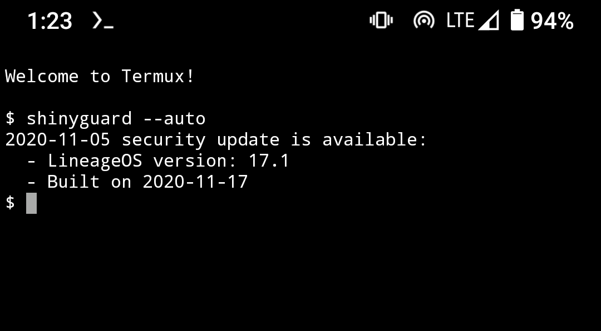

# shinyguard

Check for LineageOS security updates



## Legal notice

This utility is neither endorsed by or affiliated with LineageOS project.

This utility is unable to perform a software upgrade. You need to use Updater app or apply OTA update using recovery mode.

## Introduction

*Every month*, new security updates for Android are released. You can find current patch's version in system settings ("Android security patch level"). If it's not available, then you have a bigger problem than just a missing entry.

LineageOS is an Android-based operating system which, at the moment of writing, has new builds released *weekly*. This means some updates can be skipped if you're interested only in security updates. And this is why I've made this app.

An important thing to note is that a security patch version of 2020-11-05 does not mean upstream patches were merged at that day. What's more, sometimes you'll need to wait another week for OTA update to be generated for your device.

## Installation

Latest release is built automatically by GitHub CI system. This package is NOT available in PyPI.

- [Download](https://github.com/shinycore/shinyguard/releases/latest)
- Run `pip install <FILENAME>`

## Usage

### Command line interface

If you have [Termux](https://termux.com) installed on your **LineageOS** device, this is the easiest way to use the software:

```bash
$ shinyguard -a
```

Otherwise you need to tell more about your device. This is an example usage for Google Pixel 4 XL:

```bash
$ shinyguard -d coral -p 2020-10-05 -b 2020-11-01
```

Result:

```
2020-11-05 security update is available:
  - LineageOS version: 17.1
  - Built on 2020-11-15
```

See `shinyguard -h` for more details.

## Development stuff

### Tech stack

- `requests`, no surprise here
- `marshmallow` schemas for 3rd party APIs
- Command line utility (`docopt`)
- Unit tests (`pytest`)
  - 100% coverage
  - Cache for 3rd party API responses
- Automated GitHub releases

### Installing from source

Using [Poetry](https://python-poetry.org):

```bash
(.venv) $ poetry install
```

### Python library

```python
import datetime
from shinyguard import UpdateState, check_for_updates

result: UpdateState = check_for_updates(
    device="coral",
    patch_date=datetime.date(2020, 10, 5),
    build_date=datetime.date(2020, 11, 1)
)
```

Result:

```python
UpdateState(
    has_update=True,
    patch_date=datetime.date(2020, 11, 5),
    build_date=datetime.date(2020, 11, 15),
    version='17.1'
)
```

### Unit tests with coverage

```bash
$ ./coverage.sh
```

Test results are exported to `/tmp/coverage`.

### Code style enforcement

```bash
$ git config core.hooksPath .githooks
```

Incorrectly formatted code (`.py` files, snippets in README.md) cannot be committed.
